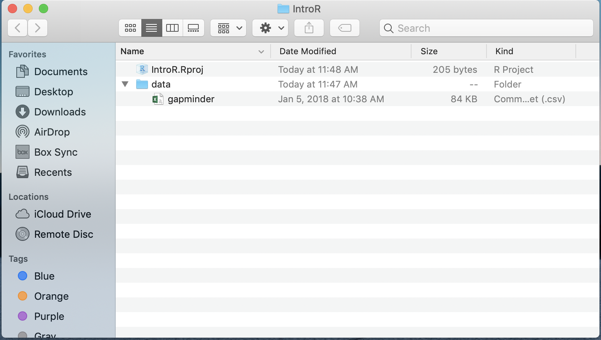

Help with installation of R and RStudio

Open RStudio

R is the underlying statistical computing environment. You can think of this like the engine of a car. That makes RStudio like the dashboard.

RStudio is an integrated development environment (IDE) that allows us to interact with R. RStudio sits on top of R and makes writing and executing R code a lot easier. We'll be benefiting from many of the added features that come with RStudio and we will point them out as we go.

## History

R was developed by Ross Ihaka and Robert Gentleman at the University of Aukland in the 1990s and was released to the public as free, open source software in 2000. It is based on the language S, developed at Bell Labs by John Chambers in 1976. 

R is currently maintained by the R Core Team based in Vienna. This group maintains the Comprehensive R Archive Network (CRAN) where R packages are vetted and stored. A median of 21 packages are added daily. 

RStudio was founded in 2008 and launched its first public release of RStudio in 2011. It is a company with enterprise products for sale but that will continue to support the IDE for free. Their Chief Data Scientist is Hadley Wickham. Together with other RStudio developers, they have written several packages with a unified syntax, called the tidyverse packages (readr, dplyr, ggplot2, tidyr, purrr, etc.). The goal of these packages is to improve code readability and consistency.

Today we will not be introducing tidyverse packages, but you will no doubt see those soon.

In 2012, the first RLadies social group was founded to improve accessibility and support to women R users and today there are 122 chapters, including one in Charlottesville. I would encourage all of you to join us on MeetUp.com. RStudio in particular does a lot to support diversity and inclusion. One place to start interacting with this community is twitter with the #rstats

## Panes in RStudio

When you open RStudio, you will have access to R (there is no need to open R directly). 

Now go to the top menu to open a new R Script File --> New File --> R Script

Great! Now you will see four panes

- I have mine set up as follows:
    - Editor / script / source on the top left
    - Console on the bottom left
    - Environment/history on the top right
    - Files / Plots / Help on the bottom right
    
- On the top left is the *script* or editor window. This is where we are going to write all of our code.

- On the lower left we have the *console* window. This is where R is running, and this is what you would see if you opened R instead of RStudio. In this pane we can see the code we send and then the answer.

- The top right has the *Environment* and history tabs. The Environment is a list of all objects that are saved in memory. The History tab shows all commands that have been run.

- On the bottom right hand side there's a window with several tabs.
    - *Files* shows the file structure of the working directory.
    - *Plots* is where your visualizations will appear. 
    - Packages shows all of the installed packages where checked ones are loaded and unchecked packages are not loaded.
    - *Help* shows information about functions.
    - Viewer for viewing other kinds of output, like web content.

To change your preferences for the pane layout go to Tools --> Global Options --> Pane Layout. The Global Options menu is also where you can change the font size, background color, and other useful preferences.

There is one preference that we recommend you change right now. That is the _soft wrap_ feature that will wrap long lines of code or comments onto several lines so that you do not need to scroll right to see the whole code or sentence. Go to Tools --> Global Options --> Code --> click the box next to _Soft Wrap R Source files_

## Set up an R Project

I mentioned previously that RStudio has a lot of handy features. One of those is the project structure

Before we can start writing code we need to set up a project so that the data and our codes will be in the same place. Go to File --> New Project--> New Directory. I will name mine IntroR and it will be a folder on my desktop

Now we have opened up a new instance of RStudio running inside the IntroR folder. Notice on the top of the console pane and the Files pane (bottom right) that the path to the IntroR folder is specified.

When we start reading in data it will be important that the _code and the data are in the same place._ Creating a project creates an Rproj file that runs R  _in that folder_. If you are familiar with working directories, this process is setting the working directory for this project as this folder. 

Once you have a project set up, when you want to read in dataset _whatever.txt_, you will be able to easily specify the path pointing to _whatever.txt_ rather than having to specify a full path. This is critical for reproducibility, and we'll talk about that more later.

To get things arranged for later, please download the dataset we are going to use. Click the link below to open the file in a new github page. Find the `Raw` button then right click and `Save as` to download the file to your computer.

[gapminder data set](data/gapminder.csv)

Move the dataset to your IntroR directory in a subfolder called **data**.

{width=450px}

Now that we have a project directory and the dataset inside that project directory, let's open up a new script and begin coding! Go to File --> New --> New R Script

Code that you type into the console is code that R executes. Let's try it. In the console type:

```{r}
2 + 5
```

From here forward we will use the editor window to write a script that we can save to a file and run it again whenever we want to. We usually give it a `.R` extension, but it's just a plain text file so it can be opened by any text editor program. 

## R as a calculator

R can be used as a calculator. Make sure you're typing into the editor, not the console. Use the run button in the top right of the script to run the code.

```{r calculator}
2 + 2
```

Notice the output in the console that tells us the code we wrote and the answer. Let's try some others. Notice I put spaces around the operators. R will allow spaces in most places, so please make your code nicely readable by humans.

```{r}
5 * 4
2 ^3
```

Instead of using the Run button to run code, let's try the keyboard shortcut to run code. To send code from the editor to the console, use `CMD`+`Enter` (Mac) or `Ctrl`+`Enter` (Windows). This is **way** faster than using your mouse to hit the Run button each time.

Go back to your code above and run them using the keyboard. We can also run multiple lines of code at once. Now highlight 2 lines of code and run them together.

R also knows order of operations and scientific notation.

```{r calculator2}
(5 + 3)^2
5 + 3^2

5e4
```

## Comments

Anything after a `#` sign is a comment, meaning it will not be executed as code. Use them liberally to *comment about what you are doing and why*. 

Add `# R as a calculator -------` as a heading above your arithmetic code. On the top right of the script window is a table of contents where you can see the organization of code based on headings. Headings are created with 4 or more of the same character (#, -, or =).

There is a keyboard shortcut to add a new section heading. `CMD + Shift + R` (mac) or `CTRL + Shift + R` (pc)

Today, you can take notes about what you are learning as comments in your script.

Comments are a big part of making your work reproducible for others and for your future self when you open this script a few months from now and need to remember what you were doing.

Commenting is also helpful when you're testing things out during your analysis so that you can 'turn off' parts of your script. 

```{r}
# Here is a comment
# Note that anything after the # is considered a comment
```

Let's save our script before we get any further.

Go up to File --> Save As and let's go with "intro.R"

## Creating R objects

Let's learn to create R objects next. We assign _values_ to _objects_ using the assignment operator "<-". This arrow is typed with a less than sign followed by a dash. We first name the object on the left and then provide the assignment operator `<-`, and then the value. Notice the spaces around the `<-` making it easier to read the code

Let's create an object called weight kg that takes the value 55.

```{r assignment}
weight_kg <- 55
```

Look in the Environment pane (top right) to see your new R object!

`<-` is the assignment operator in R. It assigns values on the right to object names on the left. Think of it like an arrow that points from the value to the object. The `<-` is mostly similar to `=` but not always. Learn to use `<-` as it is good R programming practice. Using `=` in place of `<-` can lead to issues down the line. The keyboard shortcut for inserting the `<-` operator is `option + dash`(mac) and `Alt + dash` (pc).

- Objects can be given any name such as `x`, `current_temperature`, or `subject_id`, but they may not have a space in the name. You want your object names to be explicit and not too long. They also cannot start with a number (`2x` is not valid but `x2` is). R is case sensitive (e.g., `weight_kg` is different from `Weight_kg`). 

```{r case sensitive}
Weight_kg <- 55
```

Look in the Environment pane to see that there are now 2 different weight objects since we used different casing in the spelling of the object names.

There are some words that should not be used as object names because they represent the names of functions in R. It is best to not use function names as object names since it will be confusing to tell the difference between the object and the function (e.g., `c`, `T`, `mean`, `data`, `df`, `weights`). 

If in doubt, start typing the name and if RStudio suggests something it already knows, then that name is already in use. 

For example, it is perfectly reasonable to think that data is a great name for your dataset but as you start to type it, the autocomplete function in RStudio tells you that `data` already exists.

```{r data}
data()
```

Try to use nouns for object names, and verbs for function names to help yourself remember what each item is.

When assigning a value to an object, R does not print anything. You can ask to print the value by typing the object name:

```{r printAssignment}
weight_kg
```

Now that R has `weight_kg` in memory, we can do arithmetic with it. For instance, we may want to convert this weight in pounds (weight in pounds is 2.2 times the weight in kg).

```{r modAssignment}
2.2 * weight_kg
```

We can also change an object's value by assigning it a new one:

```{r newAssignment}
weight_kg <- 57.5
2.2 * weight_kg
```

Let's store the weight in pounds in a new object called weight_lb. Remember to put the name on the left and then the arrow pointing to the name.

```{r calculationWithVar}
weight_lb <- 2.2 * weight_kg
```

Now let's change `weight_kg` to 100.

```{r modAssignment2}
weight_kg <- 100
```

What do you think is the current content of the object `weight_lb`? 126.5 or 220? Why?

Check your answer

```{r, eval=FALSE}
weight_lb
```

----

## EXERCISE 1

Try these on your own

A. You have a patient with a height (inches) of 73 and a weight (lbs) of 203. Create r objects labeled 'height' and 'weight'.

B. Convert 'weight' to 'weight_kg' by dividing by 2.2. Convert 'height' to 'height_m' by dividing by 39.37

C. Calculate a new object 'bmi' where BMI = weight_kg / (height_m*height_m)


<details><summary>SHOW ANSWER</summary>
```{r ex1, results="hide"}
height <- 73
weight <- 203

weight_kg <- weight / 2.2
weight_kg
height_m <- height / 39.37
height_m

bmi <- weight_kg / (height_m * height_m)
bmi
```
</details>

----

You can remove objects from the environment using the `rm()` function. You can do this one at a time or remove several objects at once by separating their names with `,`. The broom button in the Environment pane will remove all objects from your environment.

```{r rm}
rm(weight_lb, Weight_kg)
# Now ask R for weight_lb (uncomment the following line and run it)
# weight_lb 
# oops! you should get an error because weight_lb no longer exists!
```

The `ls()` function will list all objects in the environment.

```{r}
ls()
```


## Built-in Functions

R has many built-in functions. In fact, we already used the `rm()` and `ls()` functions to remove and list objects in the envrionment. A function is denoted in R by a word followed by (). For example, let's use a function most of us will be familiar with. The function to calcualte a square root is `sqrt()`. Let's take the square root of something we know the answer to, like 144

```{r fns}
sqrt(144)
```

Nice! Let's try taking the log of 1000. I am expecting to see that the answer = 3...

```{r}
log(1000)
```

But 3 is not what is returned! So now I want to know more about this function to figure out what is happening. 

To get help on a function, we can type a question mark in front of the function's name.

```{r}
?log
```

The help file has appeared in the bottom right pane of RStudio. Reading through this help file, we can see that we were taking the natural log of 1000, when we might have meant to use the `log10()` function.

```{r log}
log(1000)

log10(1000)
```

A little further down the help menu we can see a section called Arguments. Arguments are inputs to the function that change the way the function operates. Above, 1000 was the argument provided to the `log()` and `log10()` functions. In the Arguments section of the help menu, we see that we can also specify a base argument to the regular log function. 

```{r}
log(1000, base = 10) # same as log10(1000)
```

While you do not have to label the arguments, it is good practice to label them so that readers will know exactly what options you have set in the function.

```{r without arg label}
log(1000, 10)
```

This also works just fine, but labels definitely improve readability of your code and for some functions, explicility labelling argument names will be necessary.

Try typing log() again and notice that RStudio offers help in the small yellow pop-up box specifying that the default base of the log function is e, `base = exp(1)`

```{r autocompletion}
#log()
```

Once you have typed a function name with its (), you can hit the tab key to see the arguments of the function and read about them all without specificially calling up the help menu. Pretty helpful, right?

## Nesting Functions

In some cases, you may need to pass the results of one function to another function. This is called nesting functions. For example, let's take the square root of the log base 10 of 1000. 

```{r nest}
sqrt(log(1000, base = 10))
```

> Sidebar: this is a good opportunity to explore what happens when you forget to close a parentheses and you run the code. Take the above code, delete an end parentheses, run the code, and closely inspect the console. 

> Whenever you see a + in the console, R is waiting to add more code to the code you just ran before it evaluates. If this is not what you intended, click into the console and hit the `ESC` key to get a fresh console `>`. Now fix the code in the script and re-run it.

Because the `log()` function outputs a number and because `sqrt()` takes a number, we can nest the two together. You can probably suspect that as you add more and more functions in a nest, it begins to be very difficult to read. 

Readability is important, so one suggestion is to save intermediate objects to un-nest functions.

```{r assign}
myval <- log(1000, base = 10)
sqrt(myval)
```

----

## EXERCISE 2

See `?abs` and use that knowledge to calculate the square root of the log-base-10 of the absolute value of `-4*(2550-50)`. Answer should be `2`.

<details><summary>SHOW ANSWER</summary>
```{r, results="hide"}
sqrt(log10(abs(-4*(2550-50))))
```
</details>

----

## Vectors

We've talked quite a bit about R objects but we haven't yet addressed the fact that there are many different kinds of R objects. 

Besides R objects that store a single element, another extremely common kind of object you'll encounter in R is the vector. A vector is an object that contains several elements. 

We are building up to exploring a dataset, or what R calls a dataframe. Dataframes are made of several vectors, so understanding vectors in R will be important to our understanding of Dataframes.

A quick way to create a vector is to use a colon.

```{r vector}
1:5
```

This returns the numbers 1 through 5.

We can also do arithmetic with vectors. Let's add together 2 vectors of the same lengths.

```{r arith vector}
1:5 + 6:10
```

Notice that each element of the first vector is added to its pair in the second vector. So 1 is added to 6, 2 is added to 7, and so on until we have the resulting vector that represents the results of all 5 addition operations.

If we add 2 vectors of different lengths, the shorter vector will be recycled to fit the length of the longer vector

```{r}
1:10 + 1:2
```

If the length of the shorter vector is not a multiple of the length of the longer vector, we get a warning

```{r}
1:10 + 1:3
```

While the colon works to create vectors of numbers that are sequential, to create a vector of elements that are not necessarily sequential, we can use the concatenate or combine function, `c()`. 

Let's combine 1, 2 and 5 together in a vector using `c()`.

```{r cvector}
c(1, 2, 5)
```

No surprises there. Let's concatenate 1:5 with 11:15 using `c()`.

```{r}
c(1:5, 11:15)
```

There is a nice function called `seq()` to create a vector that is a sequence of numbers. Check out its help menu by typing `?seq()`

```{r}
?seq
```

Let's use what we saw in the arguments section of the help menu to create a vector that goes from to 2 to 200 stepping by 4s.

```{r}
seq(from = 2, to = 200, by = 4)
```

Vectors can be assigned names, just like we did for singular values above. Let's  assign a vector of animal weights 50, 60 and 66 to an object called `animal_weights`.

```{r animal weights}
animal_weights <- c(50, 60, 66)
```

Let's print the object by calling its name.

```{r}
animal_weights
```

So far all the vectors we have created have contained numbers. Let's create a vector of words, called a character vector in R. Strings of characters in R should each be surrounded by "character" or 'character'. We'll create a vector called `animals` that contains the names of different animals. Then we'll print the vector by calling its name.

```{r char vector}
animals <- c("mouse", "rat", "dog")
animals
```

## Inspecting Vectors

There are a lot of useful functions for inspecting a vector's contents. Remember that a dataframe is a collection of vectors, so these same functions will help us inspect the columns of our dataset. 

`length()` tells you how many elements are in the vector. Let's try it on animals and animal_weights

```{r length}
length(animals)
length(animal_weights)
```

`class()` tells you the type of object

```{r}
class(animals)
class(animal_weights)
```

This confirms that `animals` is a character vector and `animal_weights` is a numeric vector

The str() function provides an overview of the object's structure

``` {r str}
str(animal_weights)
str(animals)
```

There are no suprises here, but once we start investigating dataframes and other more complex objects, we will see how useful `str()` can be

To add elements to the end of a vector, we can use the `c()` function.

```{r cvector2}
animal_weights <- c(animal_weights, 80)
animals <- c(animals, "pig")
```

You can add elements to the beginning of a vector in a similar fashion

```{r}
animal_weights <- c(75, animal_weights)
animals <- c("rabbit", animals)
```

By reassigning to the original vector's name each time, we are overwriting its contents with the new data

Certain functions only operate on particular classes of objects. For example, let's try to take the sum of `animal_weights` and the sum of `animals`

```{r sum vectors}
sum(animal_weights)
#sum(animals) errors out
```

We can calculate the sum of `animal_weights` because it is a numeric vector. However, the `sum()` function cannot operate on a character type vector, so we get an error.

So far the functions we have used with vectors return one answer for the whole vector. However, many functions in R are vectorized meaning that they will operate on each element of a vector

For example, let's say our weights are in lbs and we want to convert all of those to kg. We can perform the conversion on the vector.

```{r}
animal_weights / 2.2
```

Maybe for some reason we want to take the square root of each of the animal_weights

```{r}
sqrt(animal_weights)
```

Again, this function is vectorized meaning that it will work element-wise.

## Indexing vectors

Indexing a vector means accessing individual elements from the vector.

To demonstrate this, let's create a vector of 50 numbers from 101 to 150. Because these elements are sequential, we can simply use the `:`. We'll call this vector x.

```{r}
x <- 101:150
```

We can access certain elements by putting the index we're interested in in square brackets after the name of the vector. For example, to return the first element of x, we type:

```{r}
x[1]
```

Note that the index starts at 1, not 0. R indexing differs from many programming languages in this sense.

To access the fifth through tenth elements of x, we can index x using a vector from `5:10`
```{r}
x[5:10]
```

If we want to see the fortieth and forty-eighth elements, because those two numbers are not sequential, we can combine them with `c()` and then index the vector based on that combination of indices.

```{r}
x[c(40,48)]
```

If we want to see all elements except the fortieth and forty-eighth, we can use a `-`

```{r}
x[-c(40,48)]
```


## EXERCISE 3

A. Ask `?rnorm` and then create a vector named `y` that contains 100 numbers sampled from a normal distribution with a mean of 2 and standard deviation of 4.

B. How many elements of y > 6?

<details><summary>SHOW ANSWER</summary>
```{r, results="hide"}
y <- rnorm(100, mean = 2, sd = 4)
sum(y > 6)
```
</details>

Why didn't we all get the same answer?

>Note that in the above, y > 4 returned a logical vector. When we sum up a logical vector, TRUE is counted as 1 and FALSE is counted as 0.

----

## DataFrames

Let's move on to learning about dataframes. There are _lots_ of different basic data structures in R. Besides the dataframe, there are also arrays, lists, matrices, etc. We are going to skip those in favor of spending time learning the data structure you'll probably use most -- the **dataframe**. 

We use dataframes to store _heterogeneous tabular_ data in R: _tabular_, meaning that individuals or observations are typically represented in rows, while variables or features are represented in columns; _heterogeneous_, meaning that columns/features/variables can be different classes (a variable like age, can be numeric, while another, like cause of death, can be a character string). 

## The Gapminder data

We have the gapminder.csv file into our project directory, but we don't know anything about it yet. Let's read it into R so we can start exploring it.

There are lots of ways to load data into R. There is a point-and-click RStudio menu and go to File > Import Data Set > Import From Text File but that is not the most reproducible way to read in data.

Instead, we would prefer that you read data into R for analysis as part of your script.

Today, we will use the `read.csv()` function to load the gapminder.csv file. A csv file stands for comma separated values and you can create a csv file in any spreadsheet program by going to File --> Save As --> choose the csv format.

The first argument we provide to `read.csv()` is the path to our dataset. Our data is in our project directory in a subfolder called data, so we will provide the path `data/gapminder.csv`. There are many other arguments in  `read.csv()`, so be sure to check those out as you are thinking about reading in your own datasets.

Just like we did with values and vectors, let's assign a name to the output of `read.csv()` to create a dataframe object. I'll name my dataset `gm` to stand for gapminder.

```{r gm}
gm <- read.csv("data/gapminder.csv")
```

Let's look at this object by calling its name

```{r, results="hide"}
gm
```

Printing large data sets to the console is ugly. There are modifications to dataframes called tibbles that make dataframes nicer to print.

For now, let's use the `View()` function to look at the data. Note that this is a read only viewer - not like Excel where you can go in and change cell values etc. This feature helps with reproducibility.

```{r, results="hide"}
View(gm)
```

Let's go back to the script. Your script is still there. It is in a tab next to the viewer tab. 

## Inspecting Dataframes

There are several functions that are useful for investigating dataframes. We already saw some of them in the section on vectors above.

Instead of printing the whole dataframe to the console, we can print an abbreviated version using `head()` and `tail()`. By default, these functions give us the first and last 6 rows respectively

```{r}
head(gm)
tail(gm)

# see the first 12 rows
head(gm, n= 12)
```

Remember, `class()` tells us the type of object

```{r class}
class(gm)
```

We can look at the number of rows and columns with `dim()`, just the number of rows with `nrow()` and just the number of columns with `ncol()`

```{r}
dim(gm)
nrow(gm)
ncol(gm)
```

`names()` will show us the column names

```{r}
names(gm)
```

And probably the two you'll use the most to inspect data frames, because they are the most descriptive, are `summary()` and `str()`. Let's start with `summary()`

```{r}
summary(gm)
```

Notice that the output depends on the type of column. For country, a character vector, we get a frequency count of the number of occurences of the first few countries. Same for continent. The other columns are numeric, so their summary is a six number summary showing the minimum, 1st quartile, median, mean, 3rd quartile, and the maximum.

The `read.csv()` determined what type of column each one was while we were reading in the data. Of course, there are arguments to change the type of column within the `read.csv()` function.

Let's look now at the structure of gm.

```{r}
str(gm)
```

The structure tells us that gm is a dataframe object and it specifies the dimensions. Below that, it also gives us each of the column names with the type of data it contains and the first 5 or 10 values for each column. 

- `country` is a coded as a factor variable, which I define as a _character vector with groups_. Because "Afghanistan" occurs several times in the dataset and we want R to recognize that all occurences of "Afghanistan" should be a group, a factor variable is the way to do that. We can see that there are 142 levels of the country factor, meaning there are 142 unique countries in our gm dataset.
    - What are the 1s in the country line? Internally, R codes factors as numbers for faster computation. Because Afghanistan is first country alphabetically, it is coded internally as a 1. The first ten lines of the dataset are Afghanistan, so 10 1s are shown.

- `continent` is also a factor variable with 5 different levels.
    - What are the 3s in the continent line? In alphabetical order, Africa will be 1, Americas will be 2, Asia will be 3, etc. Because the first 10 lines of the dataset are data on Afghanistan, and Afghanistan is in Asia, that is why we see the 3s.

- `year` is an integer variable. The first 10 values of the variable are listed
- `lifeExp` is a numeric variable. The first 5 values of the variable are listed
- `pop` is an integer variable. The first 10 values of the variable are listed
- `gdpPercap` is a numeric variable. The first 5 values of the variable are listed

## Accessing variables

Notice in the `str()` output that there is a `$` in front of each of the variable names. That symbol is how we access invidual variables / columns / vectors from a dataframe object

To access a variable from a dataframe, the syntax we want is `dataframe$columnname`

Let's use this to print out all of values in the `pop` variable. First we call the dataframe, then $ and the variable name

```{r dollar, results="hide"}
gm$pop
```

Whoa. Maybe printing out all the values of a column is not very helpful. Maybe we meant to call `head()` on one column

```{r}
head(gm$pop)
```

Using this same syntax, let's calculate the average life expectancy in the gm dataset, using the built-in `mean()` function. Notice that the `lifeExp` variable is mixed case, so be careful in spelling. However, RStudio's autocomplete function can help. Once you type the `gm$` RStudio autocompletes with the options for variable names so you can just select from the list.

```{r}
mean(gm$lifeExp)
```

The result is the average life expectancy across all countries and all years in the data set. What if we wanted to look at the average life expectancy for a particular subset of the dataframe?

In other words, we might be interested in the life expectancy for a particular country, and how that changes over years. Or maybe we want to calculate the average life expectancy across all countries, separately for each year. Or maybe the average life expectancy for different continents. Learning to subset dataframes is the first step in this process, so that is what we will do next.

----

## EXERCISE 4

1. What’s the standard deviation of the life expectancy (hint: get help on the `sd` function with `?sd`)
2. What’s the mean population size in millions? (hint: divide by `1000000`, or alternatively, `1e6`).
3. What’s the range of years represented in the data? (hint: `range()`).
4. Run a correlation between life expectancy and GDP per capita (hint: `?cor()`)

<details><summary>SHOW ANSWER</summary>
```{r}
sd(gm$lifeExp)

mean(gm$pop)/1e6
mean(gm$pop / 1e6) #divide each element by 1e6, then calculate the mean

range(gm$year)

cor(gm$lifeExp, gm$gdpPercap)
```
</details>

----

While the gm dataset is fully complete, in real life, dataframes often come with missing values. For basic statistical functions like mean, sd, etc., there is an argument `na.rm` that we can use to remove missing values prior to calculating the statistic.

In this case, the result will not change because we do not have any missings, but other data sets most definitely will, so here is what the code would look like

```{r}
# calculate the mean population
mean(gm$pop)

#calculate the mean population after removing missings
mean(gm$pop, na.rm = TRUE)
```

## Subsetting a dataframe

Often we would like to see only certain rows or perform a function on a given set of rows. To subset a dataframe, we can use `[]` like we did for vectors. Then we will learn the function `subset()`. You should know that there is another way of subsetting rows using the filter function from the dplyr package too, though we will not cover that here.

#### Subsetting using []

See rows 5:10

```{r}
# gm[5:10]
# error because dataframes are 2D so we will need to specify which rows and which columns to see
```

```{r}
gm[5:10, ]
```

See columns 2 and 3

```{r}
head(gm[, 2:3])
```

See columns by name

```{r}
myvars <- c("year", "lifeExp")
gm[1:5, myvars]
```

#### Subsetting using subset()

- The first argument to `subset()` is the dataframe we are subsetting from.
- The second argument provides logical criteria that the row will have to meet to be returned.

```{r}
?subset
```


There are six logical operators in R:

- equal to **==**
- not equal to **!=**
- greater than **>**
- greater than or equal to **>=**
- less than **<**
- less than or equal to **<=**

And you can chain multiple conditions together with an AND operator **&** or an OR **|** operator

Let's see how it works by subsetting for rows from the United States. First let's use `View()` to see how USA is spelled. Click on the country column header to sort by country to quickly navigate to the _U_ section.

```{r, eval=FALSE}
View(gm)
```

Ok, now that we know how it is spelled, we can write a line of code to subset for where country is 'United States'. We need the quotes because country is a character (factor) variable.

```{r}
subset(gm, subset = country == 'United States')
```

We do not need to specify `gm$country` because the first argument told R we would be operating within the gm dataframe. Therefore, we need only specify the variable name in the subset argument.

Now let's return the data that meets multiple criteria at once. We'll use the `&` to combine the year == 1982 and country == "United States" criteria

```{r subset}
subset(gm, subset = year == 1982 & country == 'United States')
```

We'll do one more together before you can practice on your own. Let's subset the gm dataset for rows where the population is higher than 1 billion (1e9)

```{r}
subset(gm, subset = pop > 1e9)
```

---

## EXERCISE 5

Use the `subset()` function to return rows matching the given criteria.

1. Which rows have life expectancies of more than 80 years (>80)?
2. Which countries had a low GDP per capita (< 500) in 2007?
3. Which rows have extremely low GDP per capita (< 300) OR extremely low life expectancy (< 30)?

<details><summary>SHOW ANSWER</summary>
```{r}
#1.
subset(gm, subset = lifeExp > 80)

#2.
subset(gm, subset = gdpPercap < 500 & year == 2007)
subset(gm, subset = year == 2007 & gdpPercap < 500) # order doesn't matter

#3.
subset(gm, subset = gdpPercap < 300 | lifeExp < 30)
```
</details>

---

## Plots in base R

Plots are a great way to help us explore our dataset to see relationships, investigate interactions, diagnose problems, etc.

Here we will introduce plotting using base R (without loading any extra packages). While you will definitely need base R plotting sometimes, creating publication-ready plots is easier using the R plotting package, ggplot2.

Let's start out with a histogram of the life expectancy variable from gm.

```{r hist1}
hist(gm$lifeExp)
```

R decided how many breaks to insert in the above histogram, but we can set that manually using the `breaks = ` argument.

```{r hist2}
hist(gm$lifeExp, breaks=100)
```

We can also change the color of the bars using `col = `.

```{r hist3}
hist(gm$lifeExp, breaks=100, col='blue')
```

If we wanted to look at more than one numeric variable we could try a scatterplot. The syntax for `plot(dataframe$varX, dataframe$varY)`

```{r plot2}
plot(gm$gdpPercap, gm$lifeExp)
```

The default plotting character in base R is an open circle, which I dislike. Let's change that using the `pch = ` argument, which stands for plotting character. pch ranges from 0 - 25 and you can easily search for what each looks like on the internet. I'll change mine to `pch = 16`, a filled-in circle.

```{r}
plot(gm$gdpPercap, gm$lifeExp, pch = 16)
```

Next, I would like to change the color of the points to red using `col = "red"`
```{r buildplot}
plot(gm$gdpPercap, gm$lifeExp, pch = 16, col = "red")
```

You can see the names of all 657 base R colors
```{r, eval=FALSE}
colors()
```

To add a title, the argument is `main = `

```{r}
plot(gm$gdpPercap, gm$lifeExp, pch = 16, col = "red", main = "Life Exp vs GDP")
```

Finally, we'll add an xlabel and a ylabel both in quotes.

```{r}
plot(gm$gdpPercap, gm$lifeExp, pch = 16, col = "red", main = "Life Exp vs GDP", 
     ylab = "Life Expectancy (years)", 
     xlab = "Per-capita GDP ($)")
```

There are hundreds of plotting parameters you can use to customize your plot's appearance. I know these parameters because I have learned them. The internet is your friend in this case, so if you forget how to modify a parameter, don't be afraid to Google it.

---

## EXERCISE 6

Create a plot to show the relationship between continent and life expectancy. Optional: Add color, axis labels, and a title

<details><summary>SHOW ANSWER</summary>
```{r}
plot(gm$continent, gm$lifeExp)
```
</details>

---

Visualizations are a large part of R's appeal and in our opinion, learning to plot using ggplot2 will serve you well. Therefore, we only cover the very basics of plotting using base R here.

## Write csv file

We've already seen how to read in data using read.csv(). Now we'll do the opposite. There are going to be times when you need to save the data you're working on to open up outside of R.

Just like R has functions to read data of many different formats, it also has functions to write data into many different kinds of formats. We'll stick to csv format here.

First, let's create a dataframe that is a subset of gm for just 1997. We'll name the resulting dataframe `gm97`

```{r datatowrite}
gm97 <- subset(gm, subset = year == 1997)
```

To save this as a csv file, we will call `write.csv()` where the first argument is the R object to be written and the second argurment is the name of the proposed file.

```{r}
write.csv(gm97, file = "gm97.csv")
```

Where did it go? Let's have a look at the Files pane (bottom right) and there it is. It went into our working directory (project directory) automatically. We don't need to worry about our working directory here because we're using an R project.

## Saving your work and quitting R

We'll close this lesson with how to save your work. 

Our suggestion is to make sure your R script (top left) is saved and then throw out the rest. After all, the script created the objects in the environment, the output in the console, and all the plots. Remember that to save your script, go to File --> Save or `CMD + S` (mac) and `CTRL + S` (pc).

I prefer that RStudio never ask me to save my workspace (Environment, Plots, etc) so I have set that preference in Tools --> Global Options --> General. _Save workspace to .RData on exit = "never"_. While you are at it, **uncheck** the options for 1. Restore most recently opened project 2.Restore previosuly open source documents on startup 3. Restore .RData into workspace at startup

Once your script is saved, quit RStudio. 

To re-open the project and prove to yourself that all of your hard work has been preserved, double click the Rproj file to launch RStudio in your project directory. Now open your script and start running your code.

To run all the code in an R file (there have to be no errors), highlight the entire code `CMD + A` (mac) or `CTRL + A` (pc) and then run.

Woohooo! Happy Coding!